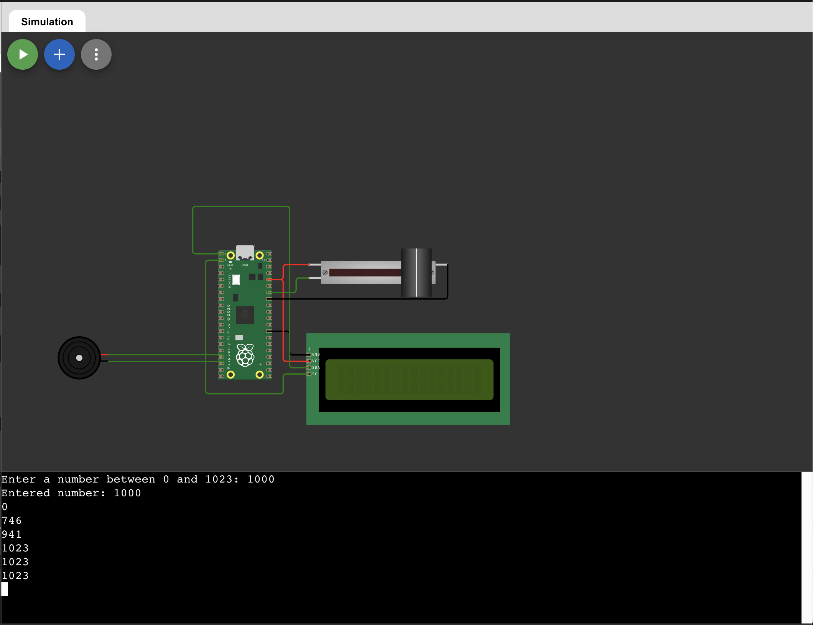

Elbette! İşte bu Python projesi için güncellenmiş README dosyası:

```
# Raspberry Pi Pico: I2C LCD Display and Buzzer with Potentiometer

This project demonstrates how to use an I2C-connected LCD display and a buzzer with a Raspberry Pi Pico. The program takes a user input number and compares it with a value read from a potentiometer. It displays the values on an LCD screen and activates a buzzer if the user input number is greater than the potentiometer value.

## Example Picture



## Requirements

- Raspberry Pi Pico
- I2C LCD Display (16x2)
- Buzzer
- Potentiometer
- Jumper wires
- Breadboard (optional)

## Hardware Connections

1. **LCD Display:**
   - SDA pin of the LCD to GPIO 0 on the Pico
   - SCL pin of the LCD to GPIO 1 on the Pico
   - VCC pin of the LCD to the 3.3V pin on the Pico
   - GND pin of the LCD to a GND pin on the Pico

2. **Buzzer:**
   - Positive pin of the buzzer to GPIO 13 on the Pico
   - Negative pin of the buzzer to GND on the Pico

3. **Potentiometer:**
   - Connect the middle pin of the potentiometer to GPIO 28 (ADC)
   - Connect the other two pins of the potentiometer to 3.3V and GND

## Software Setup

1. Install the necessary libraries:
    - `machine`
    - `time`
    - `pico_i2c_lcd`

   You can install the `pico_i2c_lcd` library using Thonny by opening the "Manage Packages" window, searching for `pico_i2c_lcd`, and installing it.

## Code Explanation

The code initializes the I2C connection to the LCD display, reads a user input number, and continuously updates the display with the user input number and the potentiometer value. If the user input number is greater than the potentiometer value, the buzzer will activate.

```python
from machine import Pin, I2C, ADC, PWM
from time import sleep
from pico_i2c_lcd import I2cLcd
import utime

# Initialize I2C and LCD
i2c = I2C(0, sda=Pin(0), scl=Pin(1), freq=400000)
I2C_ADDR = i2c.scan()[0]
lcd = I2cLcd(i2c, I2C_ADDR, 2, 16)

# Initialize Buzzer
buzzer_pin = Pin(13, Pin.OUT)
buzzer = PWM(buzzer_pin)

# Initialize Potentiometer
pot_value = ADC(Pin(28))

# Get user input number
number = int(input("Enter a number between 0 and 1023: "))

if number < 0 or number > 1023:
    print("Error: Please enter a number between 0 and 1023.")
else:
    print("Entered number:", number)

while True:
    sleep(1)
    lcd.clear()
    lcd.move_to(0, 0)
    lcd.putstr('Number: ')
    lcd.move_to(8, 0)
    lcd.putstr(str(number))
    
    # Read potentiometer value
    pot_num = int(pot_value.read_u16() // 64.0615)
    print(pot_num)
    
    if number > pot_num:        
        lcd.move_to(0, 1)
        lcd.putstr('Buyuk Sayi')
        buzzer.freq(400)
        buzzer.duty_u16(3000)
        utime.sleep(0.5)
    else:
        buzzer.duty_u16(0)  # Turn off the buzzer if pot_num <= number
```

## How to Run

1. Copy the provided code into a new file in Thonny IDE.
2. Connect your Raspberry Pi Pico to your computer via USB.
3. Select the Raspberry Pi Pico as the interpreter in Thonny.
4. Run the code.
5. When prompted, enter a number between 0 and 1023. The LCD display should update with the provided number and the potentiometer value. The buzzer will activate if the user input number is greater than the potentiometer value.

## Troubleshooting

- **LCD Display Not Showing Text:** 
  - Ensure all connections are secure.
  - Verify that the correct pins are used for SDA and SCL.
  - Check that the I2C address is correct by printing the result of `i2c.scan()`.

- **Buzzer Not Activating:**
  - Ensure the buzzer is connected to the correct GPIO pin.
  - Verify that the user input number is greater than the potentiometer value.

- **Incorrect Potentiometer Values:**
  - Ensure the potentiometer is connected properly to the ADC pin and the power supply.

## License

This project is licensed under the MIT License - see the [LICENSE](LICENSE) file for details.

## Acknowledgments

- The `pico_i2c_lcd` library for simplifying the control of the I2C LCD display.

